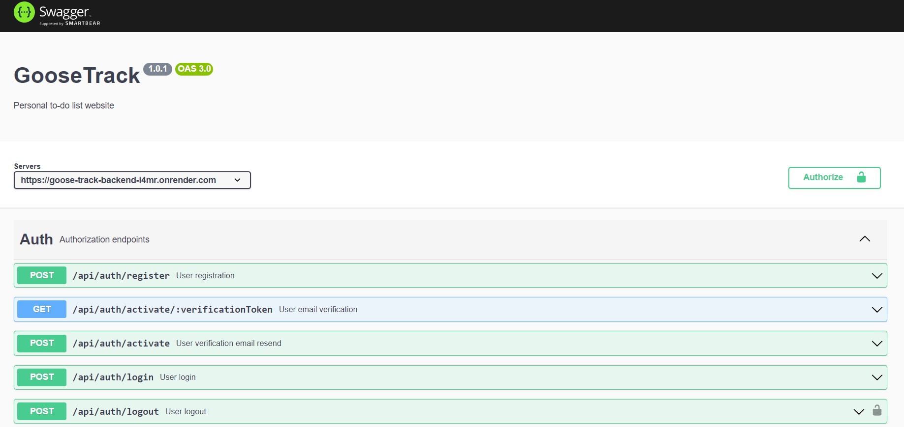

# Dare Drop Streaming Backend

This backend servise is intended to work with the front-end part of the GooseTrack web-app, created by BioLab team within GoIT academy graduation project.

## Swagger Docs

Detailed API documentation is avaliable at [this endpoint](https://goose-track-backend-i4mr.onrender.com/docs/)

```javascript
"https://goose-track-backend-i4mr.onrender.com/docs/";
```



## Base URL

The backend part of the web-app is located at render.com web service.
The base URL is indicated below:

```javascript
BASE_URL = "https://goose-track-backend-i4mr.onrender.com";
```

## Endpoints

The endpoints avaliable are listed below:

### Authentication endpoints

The **authentication endpoints** are avaliable at the route

```javascript
"/api/auth";
```

Endpoints avaliable:

  <p><span style="color:#2596be; font-size:16px; font-weight: 600;">POST/register</span> - user registration endpoint;</p>
  <p><span style="color:#39835a; font-size:16px; font-weight: 600;">GET/activate/:verificationToken</span> - user registration endpoint;</p>
  <p><span style="color:#2596be; font-size:16px; font-weight: 600;">POST/activate</span> - user verification email resend endpoint;</p>
  <p><span style="color:#2596be; font-size:16px; font-weight: 600;">POST/login</span> - user login endpoint;</p>
  <p><span style="color:#2596be; font-size:16px; font-weight: 600;">POST/logout</span> - user logout endpoint;</p>
  <p><span style="color:#39835a; font-size:16px; font-weight: 600;">GET/refresh</span> - user refresh endpoint;</p>
  <p><span style="color:#a06aa2; font-size:16px; font-weight: 600;">PATCH/user</span> - update user data endpoint;</p>
  <p><span style="color:#39835a; font-size:16px; font-weight: 600;">GET/current</span> - receive user data endpoint.</p>

### Reviews endpoints

The **reviews endpoints** are avaliable at the route

```javascript
"/api/reviews";
```

Endpoints avaliable:

  <p><span style="color:#39835a; font-size:16px; font-weight: 600;">GET/</span> - get all reviews of all users;</p>
  <p><span style="color:#2596be; font-size:16px; font-weight: 600;">POST/</span> - add new user review;</p>
  <p><span style="color:#39835a; font-size:16px; font-weight: 600;">GET/my-review/:id</span> - get current user's review;</p>
  <p><span style="color:#a06aa2; font-size:16px; font-weight: 600;">PATCH/my-review/:id</span> - get current user's review;</p>
  <p><span style="color:#df655d; font-size:16px; font-weight: 600;">DELETE/my-review/:id</span> - get current user's review.</p>

### Tasks endpoints

The **tasks endpoints** are avaliable at the route

```javascript
"/api/tasks";
```

Endpoints avaliable:

  <p><span style="color:#39835a; font-size:16px; font-weight: 600;">GET/</span> - get all user's tasks;</p>
  <p><span style="color:#39835a; font-size:16px; font-weight: 600;">GET/month/:year-:month</span> - get user's tasks by month;</p>
  <p><span style="color:#39835a; font-size:16px; font-weight: 600;">GET/month/:year-:month-:day</span> - get user's tasks by day;</p>
  <p><span style="color:#2596be; font-size:16px; font-weight: 600;">POST/</span> - add user's task;</p>
  <p><span style="color:#a06aa2; font-size:16px; font-weight: 600;">PATCH/:id</span> - update user's task;</p>
  <p><span style="color:#df655d; font-size:16px; font-weight: 600;">DELETE/:id</span> - delete user's task;</p>
  <p><span style="color:#a06aa2; font-size:16px; font-weight: 600;">PATCH/category/:id</span> - update task state category;</p>

## Technology stack

Backend part of the web-app was created using indicated tech stack:

<code></code>
<code></code>
<code></code>
<code></code>
<code></code>
<code></code>
<code></code>
<code></code>
<code></code>
<code></code>
<code></code>
